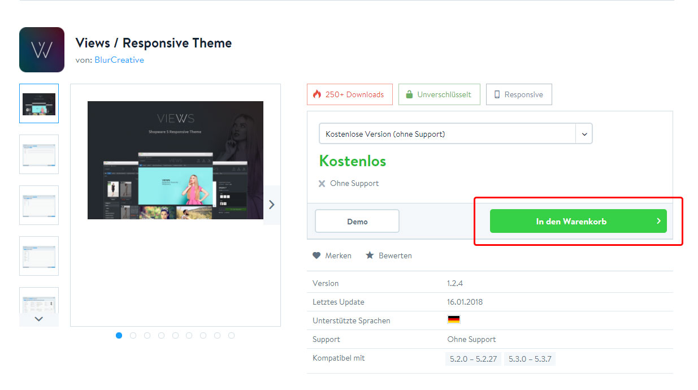
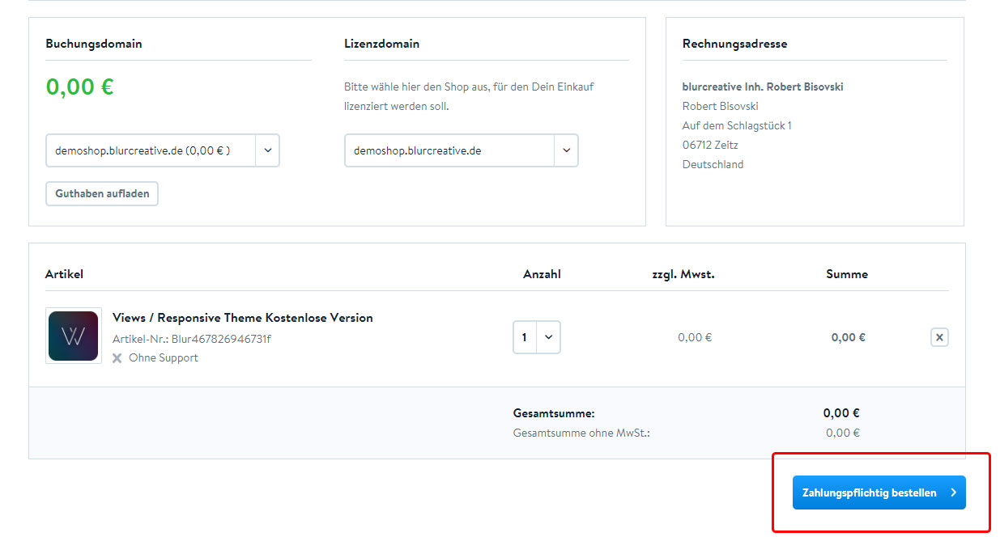
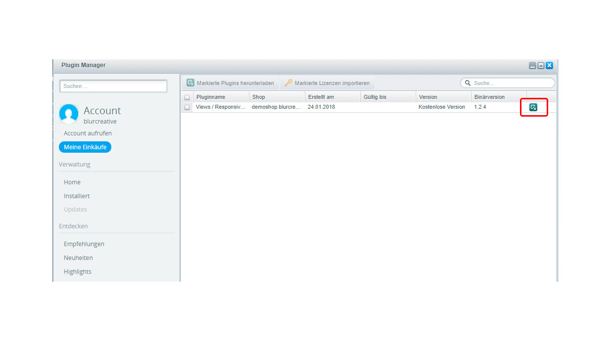
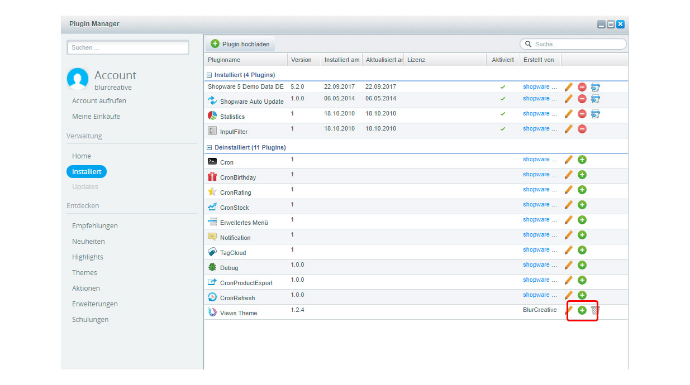

Es gibt verschiedene Wege das Theme zu installieren.
Direkt über das Shopware Backend, als Kauf über den Shopware Community Store und den manuellen Download (z.b. über GitHub)
Wir werden alle drei Wege mit dir gehen.

### Über das Shopware Backend

1. Öffne den Plugin-Manager
2. Suche im Plugin-Manger nach `Views Responsive Theme`
3. Klicke auf den Button `Kostenlos`. Danach öffnet sich ein neues Fenster mit den Theme Details. Dort klickst du auf `Jetzt herunterladen` (Eventuell musst du dich mit deiner Shopware ID einloggen)
4. Danach erscheint eine Übersicht mit dem Titel `Bestellung abschließen`. Klicke auf `Zahlungspflichtig bestellen` und schon befindet sich das Theme im Plugin-Manager unter `Installiert`
5. Klicke dann auf `Installieren / Deinstallieren` (grünes Plus) und aktiviere das Theme. Dann sollte es im Theme-Manager erscheinen und kann Eingerichtet werden.

### Über den Shopware Community Store

    

        

            1. Plugin kaufen
        

        
        

            

               Kaufe das Plugin über den <a href="https://store.shopware.com/blur467826946731/views/responsive-theme.html?number=Blur467826946731f" target="_blank">Shopware Community Store</a>
            
           
        

    

    

        

            2. Kauf bestätigen
        

        
        

            

                Wenn du den Kauf im Community Store bestätigt hast, logge dich in dein Shop Backend ein und öffne den Plugin-Manager
            
      
        

    

    

        

            3. Plugin downloaden
        

        
        

            

                Gehe auf <kbd>Meine Einkäufe</kbd> und anschließend auf das <kbd>Plugin Download</kbd> Symbol. Gehe danach auf <kbd>Installiert</kbd>
            

        

    

    

        

            4. Plugin installieren
        

        
        

            

                Klicke dann auf <kbd>Installieren / Deinstallieren</kbd> und aktiviere das Theme. Dann sollte es im Theme-Manager erscheinen und kann eingerichtet werden
            
      
        

    

### Installation per manuellen Download

Beschreibung folgt
