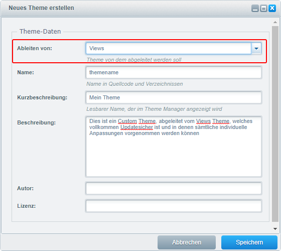

[Zurück](index.md)

# Einrichtung

### Installation

Das Plugin können Sie ganz einfach im Plugin Manager installieren und aktivieren.  
Danach erscheint es im Theme Manager und kann konfiguriert und zugewiesen werden.

Voraussetzung für das Theme ist das standardmäßige Bare und Responsive Theme in der jeweiligen Version.

### Updatesicherheit (Sub-Theme)

Um die Updatesicherheit zu gewährleisten und sicherzustellen dass Ihre Theme-Konfigurationen bei einem Update erhalten bleiben, ist es ratsam ein neues Theme abgeleitet vom Views Theme zu erstellen.

Dazu klicken Sie im Theme Manager auf 'Theme erstellen' und geben die erforderlichen Daten ein.  
Wichtig ist dass Sie bei 'Abgeleitet von:' die Auswahl auf 'Views' stellen.  
Achtes Sie darauf dass der Name des Themes keine Leer- oder Sonderzeichen enthält.

